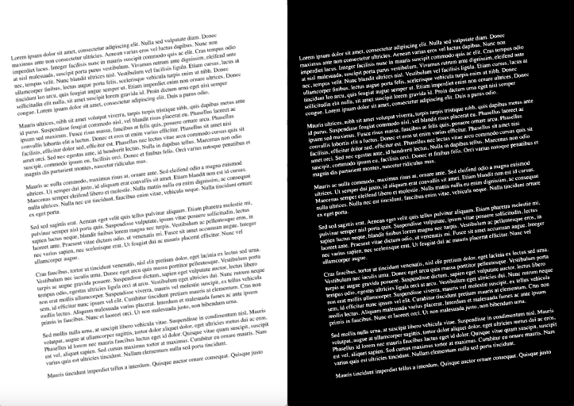
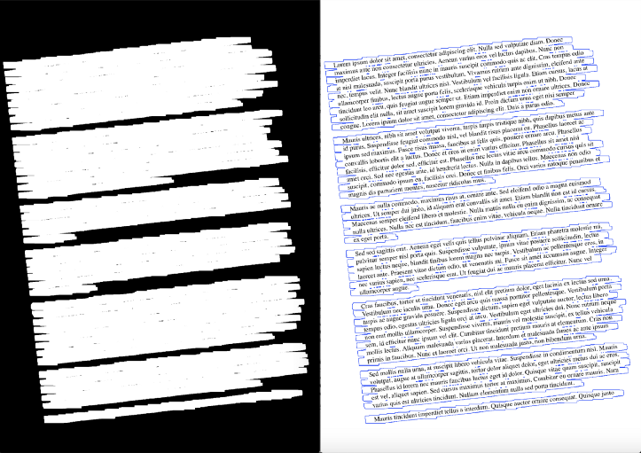
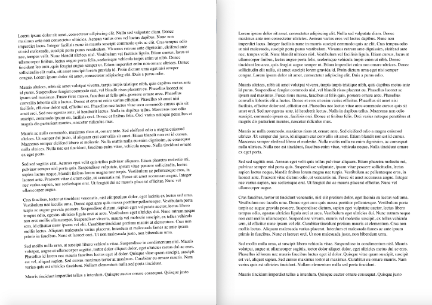
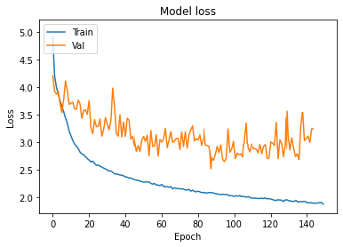

# Project 6-2 (기업 협업)
---
## 프로젝트 목표

 - 문서 이미지의 주요값 인식

    1) 딥러닝 네트워크를 활용하여 문서 이미지 회전 각도를 예측하는 모델 학습  
       (합성 데이터 11,948 활용 - train, validation 나눠 활용)  
       (학습시 이미지를 실제 test 데이터와 분포를 유사하게 맞추는게 중요)  
       (학습데이터 추가적 합성 허용)  
       (val : 99% , test 95%)

   2) 문서를 정방향으로 맞추기 위한 각도 (0~360)  
      - 해당 각도로 회전된 문서 (학습시 회전 시켜서 학습해야함. (pdf))

       Easy : 문서 자체 왜곡 없는  
       hard : 왜곡 (구겨지거나 접힌 이미지)  
       imgaug, albumentation 라이브러리 사용  
       이미지를 구기거나 찌그려 뜨리는 부분을 만들어서 학습해도 됨.
      
 

---

# 예측 방법

예측 방법을 크게 2가지로 학습하려 한다. 이미지 인식의 CNN을 기반으로 한 각도예측과, OpenCV를 활용한 텍스트 블럭을 인식하여 각도를 예측하는 방법으로 나뉜다. 

(OCR을 한번에 진행하여 회전하면 좋겠지만, 모델의 경량화를 위해 단계를 구분한다. 이미지를 정방향으로 두는 것을 우전 과제로 두며, 학습레이어를 많이 쌓지 않는다. 가벼우면서 정확한 모델을 위해 신형 모델을 사용해도 무관하다.)

1. 문서 내 문자를 텍스트 블럭으로 인식하여 회전각 예측

2. 문서를 이미지화하여 글자 중심으로 인식하여 회전각 예측

---

# 1. OpenCV를 사용하여 텍스트 이미지 기울기 보정

## 기울기 보정 알고리즘

기울기 보정 알고리즘의 일반적인 개념에 대해 논의하는 것으로 시작하겠습니다. 우리의 주요 목표는 회전된 이미지를 텍스트 블록으로 분할하고 각도를 결정하는 것입니다. 내가 사용할 접근 방식에 대한 자세한 설명은 다음과 같습니다.

  1) 원본 이미지를 회색조로 변환 및 노이즈 감소를 위해 약간의 흐림효과
  2) 텍스트 블록 감지하기 - 텍스트 블록 감지를 더 쉽게 하기 위해 우리는 임계값을 통해 달성될 이미지의 색상을 반전하고 최대화.   
   텍스트는 흰색(정확히 255,255,255 흰색), 배경은 검정색(동일 거래 0,0,0 검정색)
  3) 텍스트 블록을 찾기위해 병합 - 흰색 픽셀 확장을 통해 확대시킴.   
  X축에 더 큰 커널을 사용하여 단어 사이의 모든 공백을 제거하고 Y축에 더 작은 커널을 사용하여 서로 간에 한 블록의 줄을 혼합하지만 텍스트 블록 사이의 더 큰 공간은 그대로 유지.
  4) 윤곽선을 둘러싸는 최소 영역 직사각형으로 간단한 윤곽선 감지가 필요한 모든 텍스트 블록을 형성.
  5) 가장 큰 텍스트 블록을 가져와 각도를 사용하여 정위치

이미지에 적용된 흐림 및 임계값

텍스트 블록의 팽장 및 윤곽 감지

가장 큰 텍스트 블록이 결정되고 최소 영역 직사각형으로 래핑됨

---

## 테스트

 원본 이미지를 -10도에서 +10도 범위에서 무작위로 회전하여 20개의 샘플 이미지에 대한 테스트 데이터 세트를 생성했습니다. 그런 다음 기울이기 각도와 함께 이미지를 저장했습니다. 
 

테스트 결과의 샘플 통계:

Item #0, with angle=1.77, calculated=1.77, difference=0.0%  
Item #1, with angle=-1.2, calculated=-1.19, difference=0.83%  
Item #2, with angle=8.92, calculated=8.92, difference=0.0%  
Item #3, with angle=8.68, calculated=8.68, difference=0.0%  
Item #4, with angle=4.83, calculated=4.82, difference=0.21%  
Item #5, with angle=4.41, calculated=4.4, difference=0.23%  
Item #6, with angle=-5.93, calculated=-5.91, difference=0.34%  
Item #7, with angle=-3.32, calculated=-3.33, difference=0.3%  
Item #8, with angle=6.53, calculated=6.54, difference=0.15%  
Item #9, with angle=-2.66, calculated=-2.65, difference=0.38%  
Item #10, with angle=-2.2, calculated=-2.19, difference=0.45%  
Item #11, with angle=-1.42, calculated=-1.4, difference=1.41%  
Item #12, with angle=-6.77, calculated=-6.77, difference=0.0%  
Item #13, with angle=-9.26, calculated=-9.25, difference=0.11%  
Item #14, with angle=4.36, calculated=4.35, difference=0.23%  
Item #15, with angle=5.49, calculated=5.48, difference=0.18%  
Item #16, with angle=-4.54, calculated=-4.55, difference=0.22%  
Item #17, with angle=-2.54, calculated=-2.54, difference=0.0%  
Item #18, with angle=4.65, calculated=4.66, difference=0.22%  
Item #19, with angle=-4.33, calculated=-4.32, difference=0.23%  
Min Error: 0.0%  
Max Error: 1.41%  
Avg Error: 0.27%  
 

<예제 샘플>

   

---
# 2. 딥러닝 모델링을 통한 각도 예측

주어진 이미지를 임의로 회전시켜 학습을 진행한다.

원본 이미지를 회전시킨다.

일부분을 확대하여 학습하여 기울기를 예측

---
## base model 구성

imagenet 트레이닝 웨이트 사용

BaseModel = EfficientNetB0

(MobileNet, VGG16, ResNet50, ResNet50V2 중 가장 좋은 인식률 모델 사용)

  

최종학습 성능

Acc : 0.8226  
Val_acc : 0.6533

---
100개의 실제 테스트 파일로 모델 확인

  

  

  

100개의 이미지를 분류하였다.

대략 78%의 정확도를 보였다.  

이미지의 테두리를 인식하는 90, 180, 270도 이미지의 경우 추가적인 문자인식을 수행해서 정방향을 맞춘다면, 92%대로 정확도가 상승하게 된다.

---
## 기대효과

이미지 회전각도 예측은 OCR에 굉장한 도움이 된다. 최근 스마트폰과 카메라를 모든 사람이 갖고 있다고 해도 과언이 아니므로 누구나 사용할수 있는 기술이 된다.

스마트폰과 인터넷을 통해 실시간으로 문자를 인식함은 팩스, 스캐너 등을 대체할 뿐만 아니라 이미지의 문자화, 더 나아가 로봇, 무인화 기기, IOT 등에 연결되어 직, 간접적으로 시너지 효과를 기대 할 수 있다.

 
 
 
 
 
 

---
---
---
### 작업 노트 

---

21/10/26  

데이터 - 합성 이미지 11,948

data 링크  
https://drive.google.com/file/d/1Byk5fABsGdYWlSuKzXwieQO_4KP0Uk_t/view?usp=sharing

--- 

21/10/27
연구방법 서칭

문서1) 이미지 인식률 개선을 위한 CNN 기반 이미지 회전 보정 알고리즘

문서2) BYOL - 자가지도 학습 (기존 자가지도 학습의 문제점을 해결)
https://yuhodots.github.io/deeplearning/21-04-04/

참고사이트

기울기 보정 알고리즘  
https://ichi.pro/ko/opencvleul-sayonghayeo-tegseuteu-imijileul-jadong-eulo-giulgi-bojeong-ttogbalo-haneun-bangbeob-176759562404831

---

21/10/28

https://ichi.pro/ko/opencvleul-sayonghayeo-tegseuteu-imijileul-jadong-eulo-giulgi-bojeong-ttogbalo-haneun-bangbeob-176759562404831

opencv 통한 회전각 예측 - 가능
[ project_3_/기울기 보정.ipynb ]

25도 기울인 사진 => 24.883 도 예측

글 블러 - 흑백 - 줄글 인식 - 묶음 박스처리
 -> 가장 큰 사각형 인식 
 -> 수평 맞춤
(-45 ~ 45 도 사이)

=> OCR 기능 강화 및 0, 90, 180, 270 도 회전 (4번 추가) => 정방향 가능

=> 딥러닝 없이 가능..

---

21/10/29

[기울기 보정 알고리즘] 사이트 기본 정리

---

21/10/30

숫자 회전각 학습  
https://kr.mathworks.com/help/deeplearning/ug/train-a-convolutional-neural-network-for-regression.html

글 회전각 좌표  
https://lee-mandu.tistory.com/520?category=838684

회전 각에 대한 빈영역 구현  
https://blog.nerdfactory.ai/2020/09/10/image-augmentation-for-object-detection.html

https://zephyrnet.com/ko/%EB%94%A5-%EB%9F%AC%EB%8B%9D%EC%9D%84-%EC%82%AC%EC%9A%A9%ED%95%98%EC%97%AC-%EC%9D%B4%EB%AF%B8%EC%A7%80-%EC%9E%90%EB%8F%99-%ED%9A%8C%EC%A0%84/

파이썬 이미지 회전 각도 조절  
https://ansan-survivor.tistory.com/954

 - 아이디어 노트

 이미지 중심점 기준 회전 = 대각선의 길이만큼 여백이 필요함
 여백을 추가하고, 그 안에서 문서의 바운딩을 인식. 
 회전한 이미지는 여백을 제외하고 바운딩
 바운딩 기준으로 몇도 회전했느지 에측
 이후 원본으로 바로 새우기

 or

 글자박스를 인식 글 박스를 정면으로 회전
 모든 글 박스를 인식하고 글박스를 정면으로 회전.
 그 후 글 익신

 글 인식에는 글의 외곡, 회전, 기울기 등을 학습 해야 함. (한 영 숫자 기호)
 글의 외곡을 복구하는 방법 필요

---

21/10/31

원근법 이미지  
https://opencv-python.readthedocs.io/en/latest/doc/10.imageTransformation/imageTransformation.html

아이디어 노트

접혀진 종이 글씨 또는 접혀진 „‰지점을 인식 - 원근법을 인식해 비율에 따라 복구(정해진 크기가 있음)

각 부분별로 원근법을 통해 복구된 이미지들을 붙임 - 하나의 이미지로 합침

이후 글 인식

or 글 박스를 인식 - 원근법 복원을 통해 각 부분 동일 크기로 맞춤

---

21/11/01

이미지 리사이징, 이동, 회전, 원근  
https://blog.naver.com/samsjang/220504966397

테서렉트 사용 이미지 각도 예측  
https://ichi.pro/ko/ocreul-wihan-hoejeon-jeonghwagdo-choejeoghwa-68678004591838

이미지 회전 각도 예측  
https://d4nst.github.io/2017/01/12/image-orientation/

이미지 회전 깃 헙  
https://github.com/d4nst/RotNet

---

21/11/02

이미지 테두리 저장, 회전, 바운딩 박스 처리

---

21/11/03

이미지 테두리 저장, 회전 완료

바운딩 박스 및 라벨리 설정해야함

이미지 축소  
https://qzqz.tistory.com/653

---

21/11/04

이미지 학습에 관해 (cnn, rcnn, fast cnn 등)  
https://velog.io/@qksekf/%EB%94%A5%EB%9F%AC%EB%8B%9D-%EC%A0%81%EC%9A%A9-Segmentation-Object-Recognition

Rbox-CNN Rotated Bounding Box 논문 리뷰  
https://junha1125.tistory.com/21

이미지 기하학적 변형  
https://opencv-python.readthedocs.io/en/latest/doc/10.imageTransformation/imageTransformation.html

라벨링 git   (lableImg)  
https://github.com/tzutalin/labelImg

 - 설치 : pip install labelImg
 - 실행 : labelImg

---

21/11/10

이미지 배경 추가 후 1도마다 300장씩 추가 = > Wall time: 2h 24s

이미지 회전 (annotation 과 함께) => Wall time: 2h 30m 24s

이미지 학습시 :
   - 왜곡 (접힘, 휨, 구겨짐 등)
   - 그림자 (책은 안쪽, 손 or 폰 그림자, 그라데이션 그림자)
   - 밝기, 노이즈 등

---

21/11/11

이미지 배경 추가 후 1도마다 150장씩 추가 = > Wall time: 1h 56s

이미지 회전 (annotation 과 함께) => Wall time: 1h 20min 25s

xml 값 가져오기  
https://lee-mandu.tistory.com/519?category=838684

---

21/11/13

xml 수정 코드 완

 - 모든 이미지 resize 추가 코드 알아보기...

 - 기본 이미지들로 모델 생성하기

 ---

21/11/16

이미지 회전 - 바운딩 박스 - 크롭

df_train : 17분
df_test : 34 초

train -> train_angle : 3시간
train_angle -> train_angle_ro : 3시간

val -> val_angle : 10분
val_angle -> val_angle_ro : 10분

df_train : 17분 (108,000 개)
df_val : 34초 (7200 개)

train_angle_ro , val_angle_ro 폴더 내 png, xml 파일 하나의 폴더로 통합하기
train : 18 분
val : 1 분

폴더를 만들고 박스에 맞춰 이미지 resize 후 폴더에 저장
train :  28000개 28분 /
val :  분

학습 - 에폭 50
10시간 30분

모델 학습 학습

---
